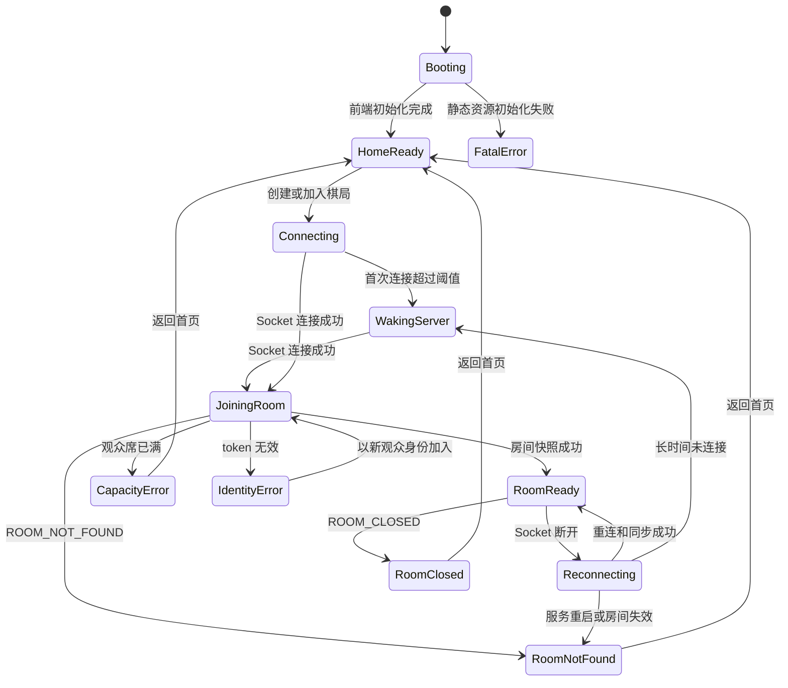
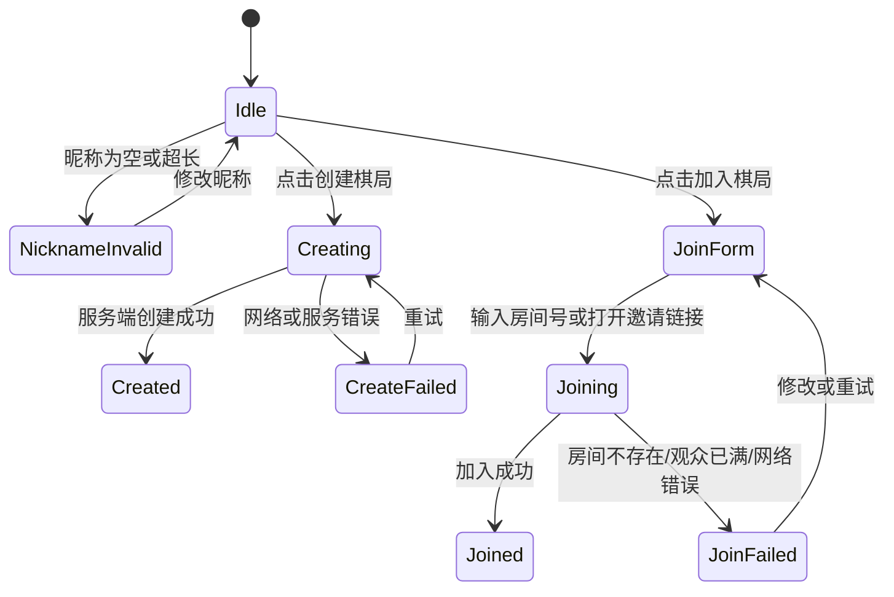
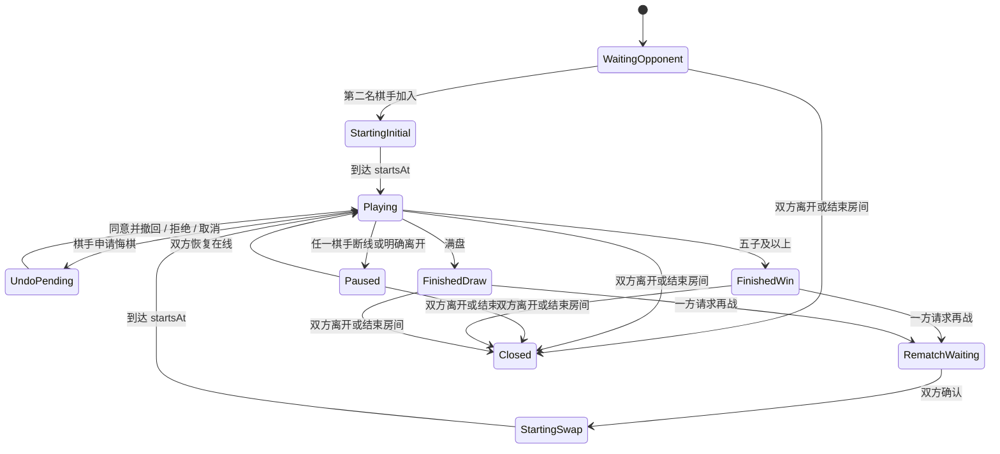
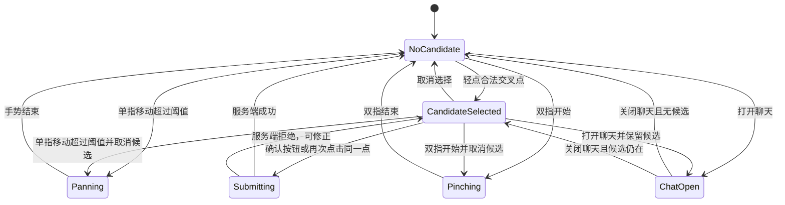

# 棋者弈也 V1 页面状态图

本文件描述客户端页面状态。页面状态与服务端房间状态相关，但不是一一对应：例如聊天抽屉、分享面板和缩放是客户端局部状态。

---

## 1. 全局应用状态



### 全局显示规则

| 状态 | 主文案 | 允许操作 |
|---|---|---|
| `Booting` | 正在加载棋者弈也 | 无 |
| `Connecting` | 正在连接游戏服务器 | 返回首页 |
| `WakingServer` | 游戏服务器正在准备中，请保持页面打开 | 继续等待、重新连接、返回首页 |
| `JoiningRoom` | 正在进入棋局 | 返回首页 |
| `Reconnecting` | 连接中断，正在恢复棋局 | 返回首页 |
| `RoomNotFound` | 棋局不存在或已经失效 | 创建新棋局、返回首页 |
| `RoomClosed` | 双方已离开，本棋局已经关闭 | 创建新棋局、返回首页 |

---

## 2. 首页状态



### 首页布局

```text
棋者弈也
好友五子棋 · ONLINE GOMOKU
无需注册，邀请好友即刻对弈

[昵称________________]
[创建棋局]

房间号 [______] [加入棋局]
```

---

## 3. 房间页面主状态



### 棋手页面状态

| 服务端状态 | 棋手主提示 | 棋盘操作 |
|---|---|---|
| `WAITING` | 等待好友加入 | 禁用 |
| `STARTING(initial_random)` | 正在随机分配黑白 | 禁用 |
| `STARTING(rematch_swap)` | 双方已交换黑白 | 禁用 |
| `PLAYING` 且轮到自己 | 轮到你 | 启用 |
| `PLAYING` 且轮到对方 | 等待对方落子 | 禁用 |
| `PAUSED` | 对方暂时离线，棋局已暂停 | 禁用 |
| `FINISHED(win)` | 黑胜或白胜 | 仅浏览 |
| `FINISHED(draw)` | 和棋 | 仅浏览 |
| `CLOSED` | 棋局已经关闭 | 禁用 |

### 观众页面状态

| 服务端状态 | 观众主提示 |
|---|---|
| `WAITING` | 等待第二名棋手加入 |
| `STARTING` | 正在分配或交换黑白 |
| `PLAYING` | 黑/白棋回合 |
| `PAUSED` | 棋手暂时离线，棋局暂停 |
| `FINISHED` | 黑胜、白胜或和棋 |
| `CLOSED` | 棋局已经关闭 |

观众页面始终不显示落子、悔棋和再战操作。

---

## 4. 手机端对局界面状态



### 顶部固定栏

```text
● 你执黑 ｜ 轮到你 ｜ 对手在线
确认落子：开
```

### 底部固定栏

```text
有候选：取消选择 ｜ 确认落子 ｜ 聊天 2 ｜ 更多
无候选：确认：开 ｜ 悔棋 ｜ 聊天 2 ｜ 更多
观众：  聊天 2 ｜ 分享房间 ｜ 棋盘居中 ｜ 更多
```

---

## 5. 覆盖层与抽屉状态

同一时间只允许一个主要覆盖层：

- `ShareSheet`
- `ChatDrawer`
- `MoreMenu`
- `UndoDialog`
- `LeaveConfirm`
- `ResultSheet`

优先级：

1. 连接或房间关闭错误。
2. 离开确认。
3. 悔棋请求。
4. 胜负结果。
5. 聊天、分享和更多菜单。

胜负发生时：

```text
获胜连线高亮
→ 印章出现
→ 600ms 后 ResultSheet 展开
```

---

## 6. 页面状态与 URL

| URL | 页面 |
|---|---|
| `/` | 首页 |
| `/room/:roomId` | 房间页；先连接后端再加入或恢复身份 |

必须监听浏览器 `popstate`：

- 从房间返回首页时更新 React 状态。
- 前进回房间时重新执行加入或恢复流程。
- 直接刷新 `/room/:roomId` 时由静态站点 rewrite 到 `/index.html`，客户端再解析房间号。
