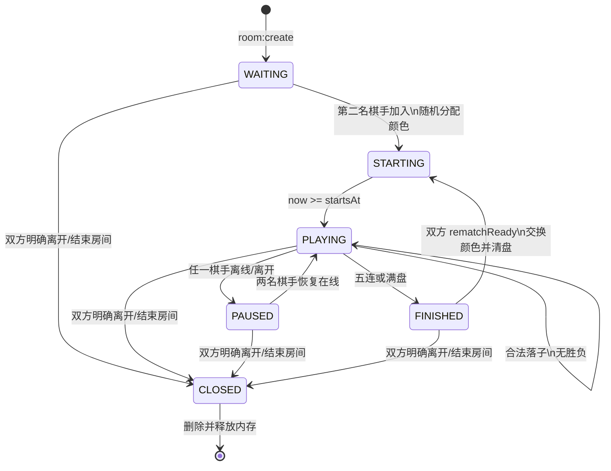

# 棋者弈也 V1 服务端房间状态机

服务端是棋局唯一权威来源。客户端提交动作，服务端校验后广播快照或事件。

---

## 1. 状态模型

### 1.1 主状态

```ts
export type RoomStatus =
  | "WAITING"
  | "STARTING"
  | "PLAYING"
  | "PAUSED"
  | "FINISHED"
  | "CLOSED";
```

含义：

| 状态 | 含义 |
|---|---|
| `WAITING` | 只有一名棋手，等待第二名棋手。 |
| `STARTING` | 已分配颜色或已交换颜色，等待统一开始时间。 |
| `PLAYING` | 正常对局。 |
| `PAUSED` | 对局中至少一名棋手不在线或已明确离开。 |
| `FINISHED` | 胜负或和棋已产生。 |
| `CLOSED` | 房间删除前的终止状态，仅用于向在线参与者发送关闭事件。 |

### 1.2 附属状态

```ts
export type Presence = "ONLINE" | "DISCONNECTED" | "LEFT";
export type StartReason = "INITIAL_RANDOM" | "REMATCH_SWAP";
export type FinishReason = "BLACK_WIN" | "WHITE_WIN" | "DRAW";
```

悔棋和再战不作为独立主状态，使用字段表达：

```ts
pendingUndo: PendingUndo | null;
rematchReady: Record<PlayerId, boolean>;
```

存在 `pendingUndo` 时，服务端拒绝落子。

---

## 2. 推荐内部数据结构

```ts
interface Participant {
  id: string;
  tokenHash: string;
  nickname: string;
  role: "PLAYER" | "SPECTATOR";
  presence: Presence;
  socketId: string | null;
  joinedAt: number;
  lastSeenAt: number;
  lastChatAt: number;
}

interface PlayerSeat {
  participantId: string;
  color: "black" | "white";
}

interface Room {
  id: string;
  status: RoomStatus;
  startReason: StartReason | null;
  startsAt: number | null;
  pausedFrom: "PLAYING" | null;

  players: [Participant, Participant | null];
  colorByPlayerId: Record<string, "black" | "white">;
  spectators: Map<string, Participant>; // max 5

  board: ("black" | "white" | null)[][];
  currentTurn: "black" | "white";
  moveHistory: MoveRecord[];
  winningLine: Point[];
  finishReason: FinishReason | null;

  pendingUndo: PendingUndo | null;
  rematchReady: Record<string, boolean>;

  processedActions: Map<string, ActionResult>; // actionId 去重
  createdAt: number;
  updatedAt: number;
}
```

重要变化：

- 玩家身份与颜色分离。
- 观众单独存储，不塞进黑白棋手位。
- 聊天消息不存入 `Room`，只实时广播。
- token 在服务端建议只保存哈希；客户端保存原 token。

---

## 3. 主状态转移



---

## 4. 状态转移明细

### 4.1 创建房间

事件：`room:create`

前置条件：

- 昵称有效。

处理：

- 创建稳定参与者 ID 和 token。
- 角色为 `PLAYER`。
- 放入 `players[0]`，但暂不确定颜色。
- 状态 `WAITING`。
- 返回 roomId、participantToken、公开快照。

### 4.2 加入房间

事件：`room:join`

处理顺序：

1. token 命中已有棋手或观众：恢复原身份。
2. 无 token 且第二棋手位为空：创建第二名棋手。
3. 第二棋手加入后：
   - 服务端随机决定两人颜色。
   - 初始化棋盘。
   - `status = STARTING`。
   - `startReason = INITIAL_RANDOM`。
   - `startsAt = now + 1000`。
4. 两名棋手均存在：创建观众。
5. 观众已达 5 人：拒绝。

### 4.3 开始对局

内部定时任务或每次动作前惰性检查：

```ts
if (room.status === "STARTING" && Date.now() >= room.startsAt) {
  room.status = bothPlayersOnline(room) ? "PLAYING" : "PAUSED";
}
```

### 4.4 落子

事件：`game:placeStone`

必须校验：

- `actionId` 未处理。
- token 对应棋手，非观众。
- `status === PLAYING`。
- 双方 `ONLINE`。
- 无待处理悔棋。
- 当前回合属于该棋手颜色。
- 坐标为整数且在 0–18。
- 交叉点为空。

成功后：

1. 写入棋盘和历史。
2. 判定五连。
3. 若无胜负且步数为 361，判和。
4. 否则切换回合。
5. 广播新房间快照。

### 4.5 悔棋

事件：

- `game:undoRequest`
- `game:undoRespond`
- `game:undoCancel`

申请条件：

- 棋手身份。
- `status === PLAYING`。
- 双方在线。
- 至少有一步。
- 当前没有申请。

审批：

- 只能由另一名棋手响应。
- 同意：弹出最后一步，清空该点，回合设为被撤回颜色。
- 拒绝或取消：只清空申请。
- 棋局 `FINISHED` 后拒绝所有悔棋事件。

### 4.6 断线

Socket `disconnect`：

- 找到该 socket 对应参与者。
- `ONLINE → DISCONNECTED`。
- 棋手在 `PLAYING` 时：`status = PAUSED`、`pausedFrom = PLAYING`。
- 观众断线不改变房间主状态。
- 广播参与者状态。

恢复：

- token 匹配后更新 socketId 和 `ONLINE`。
- 两名棋手均在线且 `status === PAUSED`：恢复 `PLAYING`。
- 客户端必须重新接收完整房间快照；不能只依赖错过的增量事件。

### 4.7 明确离开

事件：`room:leave`

- 棋手：`presence = LEFT`，清空 socketId。
- 若另一名棋手仍在，房间暂停或保持结束状态。
- 双方均为 `LEFT`：
  1. `status = CLOSED`。
  2. 向房间广播 `room:closed`。
  3. 删除 Map 中的房间。
- 观众：直接从 spectators 删除，不影响房间。

同一棋手持原 token 再进入，可由产品决定是否允许从 `LEFT` 恢复。本 V1 建议允许，以满足“仍等待原棋手”的规则；恢复后置为 `ONLINE`。

### 4.8 再来一局

事件：`game:rematchReady`

条件：

- 棋手身份。
- `status === FINISHED`。
- 双方在线。

双方确认后：

1. 交换两名玩家的颜色映射。
2. 清空棋盘和历史。
3. 回合设为黑棋。
4. 清空胜负、悔棋和再战标记。
5. `status = STARTING`。
6. `startReason = REMATCH_SWAP`。
7. `startsAt = now + 800`。
8. 广播快照。

---

## 5. Socket 事件契约

### 5.1 客户端到服务端

```ts
interface BaseAction {
  roomId: string;
  participantToken: string;
  actionId: string; // crypto.randomUUID()
}

interface CreateRoomPayload {
  nickname: string;
  actionId: string;
}

interface JoinRoomPayload {
  roomId: string;
  nickname?: string;
  participantToken?: string;
  actionId: string;
}

interface PlaceStonePayload extends BaseAction {
  point: { x: number; y: number };
}

interface ChatPayload extends BaseAction {
  text: string;
}
```

事件列表：

| 事件 | 角色 | 是否改变状态 |
|---|---|---|
| `room:create` | 任意 | 是 |
| `room:join` | 任意 | 是 |
| `room:sync` | 已有参与者 | 否 |
| `room:leave` | 棋手/观众 | 是 |
| `game:placeStone` | 棋手 | 是 |
| `game:undoRequest` | 棋手 | 是 |
| `game:undoRespond` | 棋手 | 是 |
| `game:undoCancel` | 申请棋手 | 是 |
| `game:rematchReady` | 棋手 | 是 |
| `chat:send` | 棋手/观众 | 仅实时事件 |

### 5.2 服务端到客户端

| 事件 | 内容 |
|---|---|
| `room:snapshot` | 权威房间快照，不含历史聊天。 |
| `room:closed` | 房间关闭原因。 |
| `chat:message` | 单条实时聊天消息。 |
| `participant:joined` | 可选瞬时提示。 |
| `participant:left` | 可选瞬时提示。 |
| `server:shutdown` | 部署或关机前提示客户端重连。 |

### 5.3 Ack

所有客户端动作必须获得 Ack：

```ts
type Ack<T> =
  | { ok: true; data: T; actionId: string }
  | { ok: false; error: ErrorCode; actionId: string };
```

客户端可以设置 Ack 超时和有限重试。由于重试可能导致同一事件被服务端接收多次，`actionId` 去重是必需条件。

---

## 6. 公开快照

```ts
interface PublicRoomSnapshot {
  id: string;
  status: RoomStatus;
  startReason: StartReason | null;
  startsAt: number | null;

  players: Array<{
    id: string;
    nickname: string;
    color: "black" | "white" | null;
    presence: Presence;
  }>;

  spectators: Array<{
    id: string;
    nickname: string;
    presence: Presence;
  }>;

  board: ("black" | "white" | null)[][];
  currentTurn: "black" | "white";
  lastMove: Point | null;
  moveCount: number;
  winningLine: Point[];
  finishReason: FinishReason | null;
  pendingUndo: PublicPendingUndo | null;
  rematchReadyPlayerIds: string[];
}
```

不包含：

- 任何 token 或 tokenHash。
- socketId。
- 聊天历史。
- 服务端内部去重缓存。

---

## 7. 房间清理

### 产品删除

- 双方明确离开：立即删除。
- 剩余棋手点击结束房间：立即删除。

### 技术清理

为了处理浏览器崩溃、移动端被系统杀死等未触发离开事件的情况：

- 所有棋手与观众均非在线。
- `updatedAt` 超过 30 分钟。
- 删除房间。

这不是“双方明确离开立即删除”的替代，而是异常路径的内存兜底。

---

## 8. 必测状态转移

1. 创建 → 等待 → 第二棋手加入 → 随机分色 → 开局。
2. 第一局随机结果在两端一致。
3. 五连和满盘和棋。
4. 任一方断线 → 暂停 → token 重连 → 恢复。
5. 观众加入上限 5，不能落子或操作悔棋。
6. 悔棋只撤回最新一颗并恢复正确回合。
7. 胜负后悔棋被拒绝。
8. 再战双方确认 → 交换颜色 → 黑棋先手。
9. 新加入或重连无聊天历史。
10. 重复 `actionId` 不重复落子或发消息。
11. 双方明确离开 → `room:closed` → 房间查询失败。
12. 全部异常离线超过 TTL → 清理。
